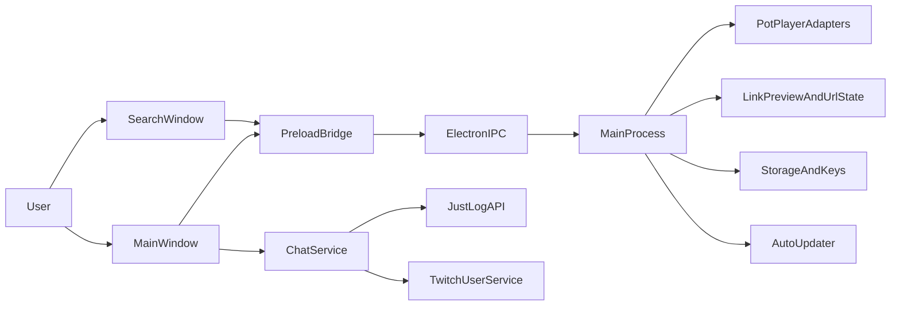
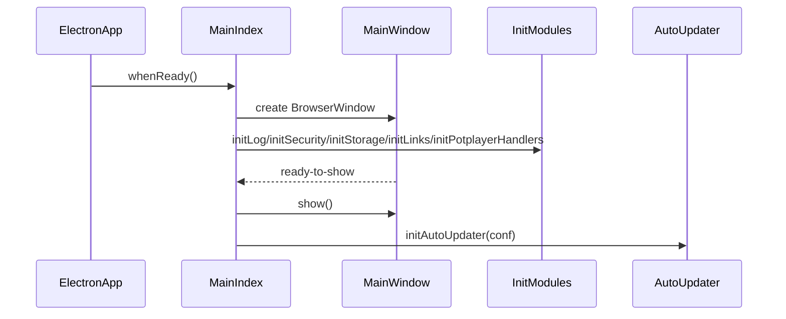
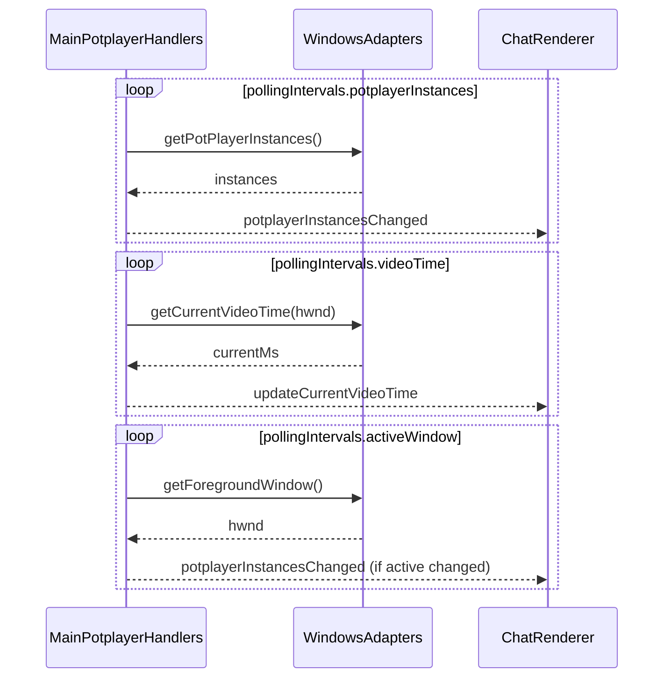
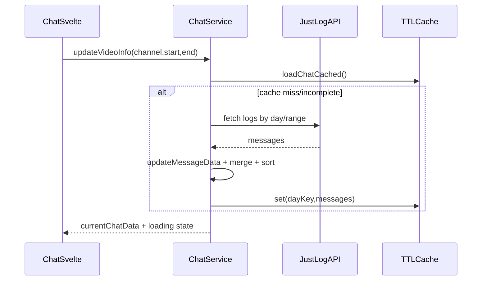

# Architecture

This document describes the runtime architecture, module boundaries, key data flows, and extension points for PotPlayerChat.

## 1) System Overview

PotPlayerChat is an Electron app with two renderer windows:

- Main window: synchronized chat view for the selected PotPlayer instance.
- Search window: focused chat search over preloaded message data.

It combines:

- Native Windows integration for PotPlayer process/window state.
- JustLog + Twitch services for message and metadata enrichment.
- Renderer-side parsing and virtualized rendering for chat UX.

## 2) High-Level Topology

## 3) Repository Structure and Responsibilities

### Main process

- `src/main/index.ts`
  - App bootstrap and BrowserWindow lifecycle.
  - Initializes security, storage, links, PotPlayer handlers, updater.
  - Owns search window creation and search IPC handoff.
- `src/main/potplayer.ts`
  - IPC handlers for PotPlayer state and polling interval controls.
  - Periodic polling loops:
    - PotPlayer instance list.
    - Current video time.
    - Active foreground PotPlayer window.
- `src/main/links.ts`
  - URL seen/clicked tracking with scalable bloom filters.
  - Link preview fetch + cache.
  - URL opening and HTML sanitization IPC endpoints.
- `src/main/storage.ts`
  - Generic JSON file load/save under `resources`.
  - Twitch key loading and in-memory key cache.
- `src/main/security.ts`
  - Header overrides for descendant windows.
- `src/main/update.ts`
  - Auto-update configuration and startup check.

### Preload

- `src/preload/index.ts`
  - Defines and exposes `window.api` surface.
  - Wraps all renderer-to-main invokes and event subscriptions.
  - Exposes electron-conf preload integration.

### Renderer

- Entrypoints:
  - `src/renderer/src/main.ts` -> `App.svelte` -> `Chat.svelte`
  - `src/renderer/src/search.ts` -> `Search.svelte`
- Core UI:
  - `Chat.svelte` main orchestration and timeline sync.
  - `ChatMessage.svelte` per-message rendering and interaction.
  - `Search.svelte` filter/search over loaded messages.
  - `Settings.svelte` runtime settings controls.
  - `LinkPreview.svelte`, `Emote.svelte` specialized subcomponents.
- Renderer logic/state:
  - `src/renderer/src/core/chat-dom.ts` message parsing + formatting pipeline.
  - `src/renderer/src/core/url-tracker.ts` URL state for UI decisions.
  - `src/renderer/src/state/settings.svelte.ts` persisted settings store.
  - `src/renderer/src/state/preview.svelte.ts` link preview state.
  - `src/renderer/src/utils/vlist.ts` virtual-list helpers.

### Shared core/domain

- `src/core/chat/justlog.ts` JustLog client and log retrieval routines.
- `src/core/chat/twitch-chat.ts` `ChatService` orchestration + cache + prefetch.
- `src/core/chat/twitch-api.ts` Twitch metadata, users, emotes, badges.
- `src/core/chat/twitch-msg.ts` message model/types and parsing helpers.
- `src/core/chat/irc.ts` IRC payload parsing.
- `src/core/os/potplayer.ts` low-level PotPlayer integration (native calls).
- `src/core/os/windows.ts` Windows foreground and process/window helpers.
- `src/core/potplayer/potplayer.ts` PotPlayer-derived stream/channel metadata.

## 4) Process and IPC Model

Electron process model:

- Main process owns native integration and privileged operations.
- Preload exposes a curated IPC contract.
- Renderer contains no direct Node/Electron privileged logic.

IPC characteristics:

- Request/response via `ipcRenderer.invoke(...)` + `ipcMain.handle(...)`.
- Event pushes from main to renderer for:
  - `potplayerInstancesChanged`
  - `updateCurrentVideoTime`
  - `focusMessage`
  - `setOffset`
- Promise-style one-shot channels are used for search payload transfer.

### Primary IPC surface (`window.api`)

Domains:

- Storage: `loadDataFile`, `saveDataFile`, `loadKeys`
- PotPlayer: `getPotPlayers`, `getSelectedPotPlayerHWND`, `setSelectedPotPlayerHWND`,
  `getCurrentVideoTime`, `getTotalVideoTime`, `getPlaylists`, `getStreamHistory`,
  `getPotplayerExtraInfo`
- Polling config: `getDefaultPollingIntervals`, `getPollingIntervals`, `setPollingIntervals`
- Links/safety: `isUrlSeen`, `addUrlSeen`, `clearUrlSeen`, `isUrlClicked`, `addUrlClicked`,
  `clearUrlClicked`, `openUrl`, `getLinkPreview`, `clearLinkPreviewCache`, `sanitizeHtml`
- Search flow: `openSearchWindow`, `getSearchInfo`, `getMessagesRaw`, `setMessagesRaw`
- Cross-window focus: `focusMessage`
- Event wiring: `on*/off*` listeners for pushed events

## 5) End-to-End Data Flows

### A) App startup and initialization

### B) PotPlayer synchronization loop

### C) Chat loading and cache usage

### D) Search window flow

1. Renderer invokes `openSearchWindow(searchInfo)`.
2. Main creates search BrowserWindow.
3. Main sends `searchInfo` and raw message payload channel data.
4. Search renderer retrieves via promise channels and performs local filtering.
5. Selecting a result emits `focusMessage` to main window.

## 6) State and Caching Strategy

### Renderer state

- Settings state in Svelte store module (`settings.svelte.ts`).
- Preview state in `preview.svelte.ts`.
- Per-component derived state for viewport, active message windows, and filters.

### Main/core caches

- Chat cache: per-day TTL cache in `ChatService`.
- URL preview cache: short TTL cache in `main/links.ts`.
- URL seen/clicked sets: scalable bloom filters persisted in config.
- Key cache: in-memory + file/env fallback in `main/storage.ts`.
- Some PotPlayer/Twitch metadata caches in core modules.

## 7) Security Model

- Privileged operations are limited to main process.
- Renderer accesses capabilities only through preload-exposed API.
- Link and message HTML content is sanitized via `sanitize-html`.
- External links are opened through controlled main-process handler.
- Security headers are injected for descendant windows.

## 8) Performance Characteristics

Key performance decisions:

- Timed polling loops with configurable intervals.
- Virtualized list rendering for large chat streams.
- TTL caches and lock-based deduplication to reduce duplicate I/O.
- Incremental prefetch around playback time windows.
- Time-indexed message querying helpers for chat windows.

Known heavy areas:

- Chat DOM parsing pipeline in `chat-dom.ts` (large, central hot path).
- Multi-day chat load and merge logic in `ChatService`.

## 9) Error Handling and Resilience

Current behavior highlights:

- Many network/file operations return null and log warnings rather than throwing.
- Locking is used for concurrent fetches and key loading.
- UI loading states represent idle/loading/error/no-data conditions.

Design implication:

- Failures are often soft-fail for UX continuity, but can hide root causes unless logs are inspected.

## 10) Build, Packaging, and Tooling

- Build system: `electron-vite`.
- Package manager: `pnpm`.
- Type checks: node + web TS configs + `svelte-check`.
- Lint/format: ESLint + Prettier with Husky/lint-staged pre-commit.
- Packaging: `electron-builder` (`build:win`, plus unpack mode).
- Some dependencies are patched via `patches/` and `pnpm.patchedDependencies`.

## 11) Configuration and Secrets

Primary configuration sources:

- `electron-conf` for runtime settings.
- JSON resources loaded from `resources`.
- Environment variables for Twitch credentials:
  - `TWITCH_CLIENT_ID`
  - `TWITCH_CLIENT_SECRET`

Fallback behavior exists for missing Twitch keys.

## 12) Architectural Constraints and Tradeoffs

- Tight coupling to Windows and PotPlayer native APIs.
- Main-process polling architecture favors responsiveness over strict event-driven purity.
- Renderer contains substantial orchestration in large components for rapid feature iteration.
- Soft-fail strategy improves usability but can reduce observability without structured telemetry.

## 13) Suggested Extension Points

- Add provider abstraction to support additional chat backends.
- Isolate polling scheduler into reusable primitives.
- Split parser pipeline into composable tested transforms.
- Add explicit domain error types and telemetry hooks.
- Introduce automated tests for parser/query helpers and service orchestration.

## 14) Glossary

- PotPlayer instance: running player window identified by HWND.
- Stream metadata: channel + timestamps used to align chat/video.
- Chat windowing: selecting relevant messages around current playback time.
- Prefetch: proactively loading chat ranges ahead of immediate UI need.
